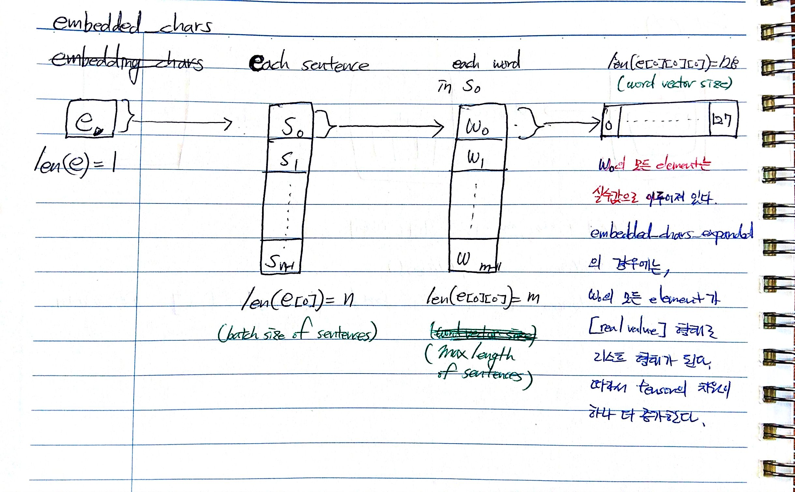

(c) JMC 2018

---

**데이터 파일 디렉토리 찾기**

```python
import os
os.listdir('.') # 현재 위치에서 파일 탐색하기
data_path = '../data/books_text_full/test/'
filename = '../data/books_text_full/test/13th_Reality-4.txt'
```

## I. vocabulary 만들기

**define vocabulary**

```python
from string import punctuation
from os import listdir
from collections import Counter
from nltk.corpus import stopwords

# 텍스트 파일의 내용을 변수 text로 리턴하는 함수
def load_doc(filename):
    # read only로 파일을 엽니다.
    file = open(filename, 'r', errors='replace')
    # 모든 텍스트를 읽습니다.
    text = file.read()
    # 파일을 닫습니다.
    file.close()
    return text

def clean_doc(doc):
    # white space 기준으로 tokenize 합니다.
    tokens = doc.split()
    # 각 token에서 모든 구두점을 삭제합니다.
    table = str.maketrans('', '', punctuation)
    tokens = [w.translate(table) for w in tokens]
    # 각 token에서 alaphabet으로만 이루어지지 않은 모든 단어를 삭제합니다.
    tokens = [word for word in tokens if word.isalpha()]
    # 각 token에서 stopwrods를 삭제합니다.
    stop_words = set(stopwords.words('english'))
    tokens = [w for w in tokens if not w in stop_words]
    # 각 token에서 1글자 이하인 모든 단어를 삭제합니다.
    tokens = [word for word in tokens if len(word) > 1]
    return tokens

# 텍스트 파일을 불러와서 vocab에 추가하는 함수
def add_doc_to_vocab(filename, vocab):
    # 텍스트 파일을 불러옵니다.
    doc = load_doc(filename)
    # 텍스트 파일을 clean toekn으로 리턴합니다.
    tokens = clean_doc(doc)
    # clean token을 vocab에 추가합니다.
    vocab.update(tokens)

# 폴더에 있는 모든 문서를 vocab에 추가하는 함수
def process_docs(directory, vocab, is_train):
    # 폴더에 있는 모든 파일을 순회합니다.
    for filename in listdir(directory):
        # 인덱스가 새겨진 파일 이름과 is_train 인자를 기준으로 test set으로 분류할 모든 파일을 건너뜁니다.
        if is_train and filename.startswith('cv9'):
            continue
        if not is_train and not filename.startswith('cv9'):
            continue
        # 폴더에 있는 파일의 절대 경로를 구합니다.
        path = directory + '/' + filename
        # 텍스트 파일을 불러와서 vocab에 추가하는 함수를 실행합니다.
        add_doc_to_vocab(path, vocab)

def save_list(lines, filename):
    # 각 문장을 하나의 텍스트 일부로 바꿉니다.
    data = '\n'.join(lines)
    # 파일을 쓰기 모드로 엽니다.
    file = open(filename, 'w')
    # 변환한 텍스트를 파일에 씁니다.
    file.write(data)
    # 파일을 닫습니다.
    file.close()

# vocab을 Counter() 객체로 할당합니다.
vocab = Counter()
# 폴더를 지정하고 폴더 내 모든 문서를 vocab에 추가합니다.
process_docs(data_path, vocab, True)
# vocab의 크기를 출력합니다.
print(len(vocab))
# vocab에서 가장 많이 등장한 50개 단어를 출력합니다.
print(vocab.most_common(50))

# token을 min_occurence 기준으로 유지합니다.
min_occurence = 1
tokens = [k for k,c in vocab.items() if c >= min_occurence]
print(len(tokens))
# token을 vocab 파일로 저장합니다.
save_list(tokens, 'corpusToLines_vocab.txt')
print("\n# 단어 {}개의 [corpusToLines_vocab.txt]로 저장했습니다.".format(len(tokens)))

# 보카를 불러옵니다.
vocab_filename = 'corpusToLines_vocab.txt'
vocab = load_doc(vocab_filename)
vocab = vocab.split()
vocab = set(vocab)
print("# 단어 {}개의 [{}]을 [vocab]으로 불러왔습니다.".format(len(vocab), vocab_filename))
```

## II. corpusToLines: 전체 코퍼스를 문장 단위 리스트로 만들기

**total_lines**

```python
from string import punctuation
from os import listdir
from gensim.models import Word2Vec

def load_doc(filename):
    file = open(filename, 'r', errors='replace')
    text = file.read()
    file.close()
    return text

def doc_to_lines(doc):
    total_lines = []
    lines = [i.lower() for i in doc.splitlines() if i]  # 공백 문장 제거 및 모든 문장 소문자 변경

    return lines

def process_directory(data_path):
    total_lines = []
    for filename in listdir(data_path):
        filepath = data_path + '/' + filename
        doc = load_doc(filepath)
        lines = doc_to_lines(doc)
        print(filename, ":", len(lines))
        total_lines += lines
    return total_lines


sentences = process_directory(data_path)
save_list(sentences, 'total_lines.txt')
print("\n# 문장 {}개의 [total_lines.txt]로 저장했습니다.".format(len(sentences)))
filename = 'total_lines.txt'
total_lines = load_doc(filename)
total_lines = [i for i in total_lines.splitlines()]
total_vocab = set()
for i in total_lines:
    total_vocab.update(i)
print("# unique words in [total_lines.txt]: [{}]".format(len(total_vocab)))
```

**clean_lines**:

```python
def doc_to_clean_lines(filename):
    total_lines = load_doc(filename)
    clean_lines = [i.lower() for i in total_lines.splitlines() if len(i) > 5 if "." in i] # 5개 단어 이상으로 이루어지고 마침표가 있는 문장만 포함

    return clean_lines

filename = "total_lines.txt"
clean_lines = doc_to_clean_lines(filename)
save_list(clean_lines, 'clean_lines.txt')
print("# 문장 {}개가 [clean_lines.txt]로 저장되었습니다.".format(len(clean_lines)))
filename = 'clean_lines.txt'
clean_lines = load_doc(filename)
clean_lines = [i for i in clean_lines.splitlines()]
clean_vocab = set()
for i in clean_lines:
    clean_vocab.update(i)
print("# unique words in [clean_lines.txt]: [{}]".format(len(clean_vocab)))
```

**vocab_lines**:

```python
def doc_to_vocab_lines(filename):
    clean_lines = load_doc(filename)
    vocab_lines = []
    for i in clean_lines.splitlines():
        words = i.split()
        words = [word for word in words if word in vocab]
        words = [word for word in words if len(words) >= 5]
        vocab_line = " ".join(words)
        if len(vocab_line):
            vocab_line += "."
            vocab_line = [vocab_line]
            vocab_lines += vocab_line

    return vocab_lines

filename = "clean_lines.txt"
vocab_lines = doc_to_vocab_lines(filename)
save_list(vocab_lines, 'vocab_lines.txt')
print("# 문장 {}개가 [vocab_lines.txt]로 저장되었습니다.".format(len(vocab_lines)))
filename = 'vocab_lines.txt'
vocab_lines = load_doc(filename)
vocab_lines = [i for i in vocab_lines.splitlines()]
vocab_vocab = set()
for i in vocab_lines:
    vocab_vocab.update(i)
print("# unique words in [vocab_lines.txt]: [{}]".format(len(vocab_vocab)))
```

## III. word2vec

**list_lines: word2vec 만들기 전 모든 문장을 token 묶음의 리스트로 만들기**

```python
filename = "vocab_lines.txt"

file = open(filename, 'r', errors='replace')
text = file.read()
file.close()

vocab_lines = [i for i in text.splitlines()]

list_lines = []
for i in vocab_lines:
    i = i.split()
    list_lines.append(i)

print(list_lines[0])
```

**word2vec**:

```python
sentences = list_lines
print("Total training sentences:{}".format(len(sentences)))

wv_sz = 100
# word2vec 모델을 훈련시킵니다.
model = Word2Vec(sentences, size=wv_sz, window=5, workers=8, min_count=1)
# 모델의 vocabulary size를 요약합니다.
words = list(model.wv.vocab)
print("Vocabulary size: %d" % len(words))
print("Wordvector size: %d" % (wv_sz))
print("Embedding size: {}x{}".format(len(words), wv_sz))

# 모델을 ASCII 포맷으로 저장합니다.
filename = 'fantasy_embedding_word2vec.txt'
model.wv.save_word2vec_format(filename, binary=False)
print("\n# word2vec 파일 [{}]이 저장되었습니다.".format(filename))
```

## IV. Use pre-trained word vector

**encoded_lines to x_data**:

```python
import tensorflow as tf
import numpy as np

from tensorflow.contrib import learn

max_length = max([len(s.split()) for s in vocab_lines])
vocab_processor = learn.preprocessing.VocabularyProcessor(max_length)
encoded_lines = np.array(list(vocab_processor.fit_transform(vocab_lines)))
print("-"*80,"# [vocab_lines]가 [encoded_lines]로 인코딩 및 패딩 되었습니다. (max_length:{})".format(max_length), "-"*80, sep='\n')
print("BEFORE: \n{}".format(vocab_lines[0]))
print("\nAFTER: \n{}".format(encoded_lines[0]))

x_data = np.array(list(encoded_lines))
print("\n", "-"*80,"# 최종 [x_data] (max_length: {})".format(max_length), "-"*80, sep='\n')
print("EXAMPLE: \n{}".format(x_data[0]))

vocab_dict = vocab_processor.vocabulary_._mapping
vocab_size = len(vocab_dict.keys())
print("\n", "-"*80,"# 최종 [vocab_dict] (vocab_size: {})".format(vocab_size), "-"*80, sep='\n')
print("EXAMPLE: \n[{}] is mapped to [{}].".format(vocab_lines[0].split()[0], vocab_dict[vocab_lines[0].split()[0]]))
```

**load embedding**:

```python
def load_word2vec(filename):
    vocab = []
    embd = []
    file = open(filename,'r')
    lines = file.readlines()[1:]
    for line in lines:
        row = line.strip().split(' ')
        vocab.append(row[0])
        embd.append(row[1:])
    print('Loaded {}!'.format(filename))
    file.close()
    return vocab,embd

filename = '../CNN-pairwise/fantasy_embedding_word2vec.txt'
vocab,embd = load_word2vec(filename)
vocab_size = len(vocab)
embedding_dim = len(embd[0])
embedding = np.asarray(embd)
```

## V. Build a model using TensorFlow

### 01 Embedding Layer

**hyperparameters**:

+ batch_size = how many sentences in a batch
+ sequence_length = max length of the sentences
+ embedding vector size = 128
+ embedding matrix (W).shape = [Vocabulary * embedding vector size]

```python
sequence_length = max_length
```

**input**:

```python
input_x = tf.placeholder(tf.int32, [None, sequence_length], name="input_x")
```

embedding layer에 입력되는 input_x를 플레이스홀더로 선언했다.
플레이스홀더 input_x의 shape는 (문장개수 in 1 batch, 최대 문장길이)이다.
input_x는 인코딩된 문장인 encoded_lines로 구성되어있으며 encoded_lines의 각 단어는 숫자로 맵핑되어 있다.

+ `input_x = (np.array([[1,2,3,4,5,6]]), np.array([1,7,8,4,6,0], ...))`
+ `input_x.shape` : [batch_size, sequence_length]

**embedding layer**:

```python
W = tf.Variable(
    tf.constant(0.0, shape=[vocab_size, embedding_dim]),
    trainable=False,
    name="W")

embedding_placeholder = tf.placeholder(tf.float32, [vocab_size, embedding_dim])
embedding_init = W.assign(embedding_placeholder)
```

W는 word embedding matrix이다.
input_x는 batch 개수만큼 문장이 들어있는데, 각 문장에 포함된 각 단어들은 embedding matrix W를 look up 해서 해당하는 word vector 값을 리턴한다.

```python
sess = tf.Session()
sess.run(tf.global_variables_initializer())
sess.run(embedding_init, feed_dict={embedding_placeholder: embedding})
```

위 코드는 세션을 열고 모든 변수를 초기화한 이후에 실행해야 하며, embedding_placeholder를 feed 함으로써 embedding layer에 pre-trained embedding (`embedding` from load_embedding) 값을 feed 하는 코드이다.

**embedding lookup (embedding layer's operation)**

```python
embedded_chars = tf.nn.embedding_lookup(W, self.input_x)
```

각 문장에 포함된 각 단어들은 embedding matrix를 look up 해서 해당하는 word vector 값을 리턴한다.

+ len(embedded_chars) : a list of size 1
+ embedded_chars[0] : a list of size of batch_size, i.e, number of sentences
+ embedded_chars[0][0] : a list of size of sequence_length
+ embedded_chars[0][0][0] : a list of size of embedding vector
+ embedded_chars.shape : `[batch_size, sequence_length, embedding_vector_length]`
+ word vector의 값이 실수(real number)이다.


```python
embedded_chars_expanded = tf.expand_dims(self.embedded_chars, -1)
```

**layer output**

+ embedded_chars_expanded.shape : `[batch_size, sequence_length, embedding_vector_length, 1]`
+ word vector의 값이 실수가 아니라 실수 값에 리스트를 씌웠기 때문에 size 1인 list가 된다.



### 02 Convolution Layer

**hyperparameters**:

+ filter_size : 3, 4, 5
+ num_filters : 128
+ stride length : [1 * 1 * 1 * 1]
+ padding : VALID

이미지에서는 필터가 2D였지만, 텍스트 분류에서는 1D 필터를 사용한다.
필터 사이즈가 3, 4, 5로 되어 있는데 input마다 3개의 필터가 독립적으로 적용된다.
가령, 사이즈 3짜리 필터가 128개의 feature map을 만드는데 4, 5 사이즈 필터 또한 똑같이 적용되어 총 feature map이 384개 생성된다.
필터 3에서 나온 피쳐맵 128개와 4에서 나온 피쳐맵 128개, 5에서 나온 피처맵 128개를 합치는 방법은 뒤에서 소개한다.

**layer input**:

embedded_chars_expanded가 input이 된다.

+ embedded_chars_expanded.shape : `[batch_size, sequence_length, embedding_vector_length, 1]`

**conv layer**:

```python
# To be explained in the next pooling layer
pooled_outputs = []

# iterate 3 filters each
for i, filter_size in enumerate(filter_sizes):
    with tf.name_scope("conv-maxpool-%s" % filter_size):
        # Convolution Layer
        filter_shape = [filter_size, embedding_size, 1, num_filters]
        W = tf.Variable(tf.truncated_normal(filter_shape, stddev=0.1), name="W")
        b = tf.Variable(tf.constant(0.1, shape=[num_filters]), name="b")
        conv = tf.nn.conv2d(
            self.embedded_chars_expanded,
            W,
            strides=[1, 1, 1, 1],
            padding="VALID",
            name="conv")
        # Apply nonlinearity
        h = tf.nn.relu(tf.nn.bias_add(conv, b), name="relu")

# To be explained how to combine all the features after conv and pooling
```

tensorflow의 conv2d 함수는 input patch와 filter의 element-wise multiplication을 수행한다.
bias는 multiplication이 끝난 후에 더해줘야 한다.

```python
h = tf.nn.relu(tf.nn.bias_add(conv, b), name='relu')
```

**filter tensor**:

+ filter tensor.shape : `[filter_size, embedding_vector_length, num_input_channels, num_filters]`
+ num_input_channels : We have only one input channel, therefore, num_input_channels = 1.

**layer output**:

2D 필터는 상하 또는 좌우 2가지 방향으로 움직이므로 피쳐맵도 2차원이 된다.
그러나 여기 텍스트 분류에 쓰이는 필터는 1D 필터이고 상하 1가지 방향으로만 움직이므로 피쳐맵은 1차원이 된다.
즉 문장 하나당 피처맵의 shape은 `[max_length - filter_size + 1, 1]`이 된다.
전체 관점에서는 문장의 개수가 batch_size만큼 있고 filter의 개수가 128개이므로 convolution layer의 output shape은 `[batch_size * ( (max_length - filter_size) + 1 ) * 1 * num_filters]`가 된다.

+ for filter_size (3) : `[batch_size * ( (max_length - 3) + 1 ) * 1 * num_filters]`
+ for filter_size (4) : `[batch_size * ( (max_length - 4) + 1 ) * 1 * num_filters]`
+ for filter_size (5) : `[batch_size * ( (max_length - 5) + 1 ) * 1 * num_filters]`

### 03 Max-pooling Layer

**hyperparameters**:

+ ksize : shape of pool operator `[1 * ( (max_length - 5) + 1 ) * 1 * num_filters]`
+ stride length : same as conv2d `[1 * 1 * 1 * 1]`

**layer input**:

`@@@resume:`

+ https://agarnitin86.github.io/blog/2016/12/23/text-classification-cnn
+ http://www.wildml.com/2015/12/implementing-a-cnn-for-text-classification-in-tensorflow/

**max-pool layer**:

```python
pooled_outputs = []
for i, filter_size in enumerate(filter_sizes):
    with tf.name_scope("conv-maxpool-%s" % filter_size):
        # Convolution Layer
        filter_shape = [filter_size, embedding_size, 1, num_filters]
        W = tf.Variable(tf.truncated_normal(filter_shape, stddev=0.1), name="W")
        b = tf.Variable(tf.constant(0.1, shape=[num_filters]), name="b")
        conv = tf.nn.conv2d(
            self.embedded_chars_expanded,
            W,
            strides=[1, 1, 1, 1],
            padding="VALID",
            name="conv")
        # Apply nonlinearity
        h = tf.nn.relu(tf.nn.bias_add(conv, b), name="relu")
        # Max-pooling over the outputs
        pooled = tf.nn.max_pool(
            h,
            ksize=[1, sequence_length - filter_size + 1, 1, 1],
            strides=[1, 1, 1, 1],
            padding='VALID',
            name="pool")
        pooled_outputs.append(pooled)

# Combine all the pooled features
num_filters_total = num_filters * len(filter_sizes)
self.h_pool = tf.concat(3, pooled_outputs)
self.h_pool_flat = tf.reshape(self.h_pool, [-1, num_filters_total])
```

**merging all the outputs**:

`@@@resume:`

+ https://agarnitin86.github.io/blog/2016/12/23/text-classification-cnn
+ http://www.wildml.com/2015/12/implementing-a-cnn-for-text-classification-in-tensorflow/


---


**END**
